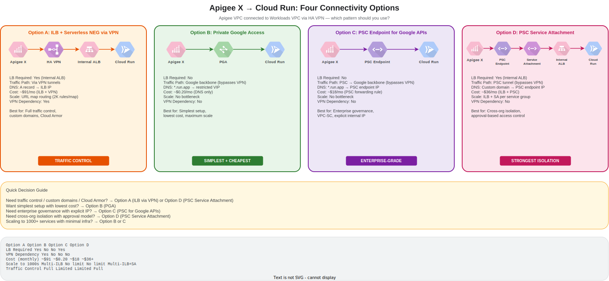

# Cloud Run Behind Apigee X

## What This Explores

When Apigee X needs to reach Cloud Run services in a separate Workloads VPC — connected via HA VPN, not direct peering — which connectivity pattern should you use?

This repo documents four architecture options and helps you choose based on:

- **Is a load balancer required?** Only for Options A and D. Options B and C reach Cloud Run directly via Google's internal network.
- **Can PGA/PSC bypass the VPN entirely?** Yes. Options B and C send traffic over Google's backbone, not through VPN tunnels.
- **Which scales best to 1000s of Cloud Run services?** Options B and C — no per-service infrastructure needed.

### Apigee Provisioning Model

This repository assumes the **VPC Peering** provisioning model, matching the organisation's existing Apigee X deployment. Apigee peers to a customer-managed "Apigee VPC" which connects to the Workloads VPC via HA VPN.

The PSC (non-peering) alternative is documented for reference in each option's deep-dive. See [Provisioning Decision](docs/apigee-provisioning-decision.md) for rationale and cost analysis.

## Comparison Matrix

| | Option A | Option B | Option C | Option D |
|---|---|---|---|---|
| **Pattern** | ILB + Serverless NEG | Private Google Access | PSC for Google APIs | PSC Service Attachment |
| **Traffic path** | Via VPN tunnels | Google backbone | Google backbone | Via PSC tunnel |
| **LB required** | Yes (Internal ALB) | No | No | Yes (Internal ALB) |
| **DNS complexity** | Medium — A records for ILB IPs | Low — `*.run.app` zone | Medium — PSC endpoint zone | Medium — PSC endpoint zone |
| **Cost (monthly)** | ~$18 (ILB) + VPN | ~$0.20 (DNS only) | ~$18 (PSC rule) + DNS | ~$36+ (ILB + PSC) |
| **Traffic control** | Full (path routing, Cloud Armor, TLS) | Limited (run.app URLs only) | Limited (run.app URLs only) | Full (path routing, TLS) |
| **Custom domains** | Yes | No | No | Yes |
| **Scale to 1000s** | Needs multiple ILBs | No bottleneck | No bottleneck | Needs ILB + SA per group |
| **VPC-SC support** | Via firewall rules | With restricted VIP | Native | Native |
| **VPN dependency** | Yes | No | No | No |

## Architecture Overview

## Deep Dives

| Option | Pattern | Doc | Diagram |
|---|---|---|---|
| **A** | Internal ALB + Serverless NEG via VPN | [docs/option-a-ilb-via-vpn.md](docs/option-a-ilb-via-vpn.md) | [diagram](docs/diagrams/option-a-architecture.drawio.svg) |
| **B** | Private Google Access | [docs/option-b-pga.md](docs/option-b-pga.md) | [diagram](docs/diagrams/option-b-architecture.drawio.svg) |
| **C** | PSC Endpoint for Google APIs | [docs/option-c-psc-google-apis.md](docs/option-c-psc-google-apis.md) | [diagram](docs/diagrams/option-c-architecture.drawio.svg) |
| **D** | PSC Published Service | [docs/option-d-psc-service-attachment.md](docs/option-d-psc-service-attachment.md) | [diagram](docs/diagrams/option-d-architecture.drawio.svg) |

### Cross-Cutting References

- [Provisioning Decision](docs/apigee-provisioning-decision.md) — VPC Peering model choice, pay-as-you-go cost analysis
- [DNS Guide](docs/dns-guide.md) — Private zones, restricted VIP, PSC auto-DNS, forwarding
- [Scaling Analysis](docs/scaling-analysis.md) — How each option behaves at 1000+ services
- [Option C Scaled](docs/option-c-scaled.md) — 20-service PoC validating Option C linear scaling

## PoC Scripts

Runnable proof-of-concept scripts for each option, deployable in a sandbox project:

| Option | Scripts | What it deploys |
|---|---|---|
| **A** | [`scripts/option1/`](scripts/option1/) | ILB + Serverless NEG + VPN infrastructure |
| **B** | [`scripts/option2/`](scripts/option2/) | PGA-enabled subnet + private DNS zone |
| **C** | [`scripts/option3/`](scripts/option3/) | PSC endpoint for Google APIs + private DNS |
| **C Scaled** | [`scripts/option3-scaled/`](scripts/option3-scaled/) | Same as C, but with 20 Cloud Run services |
| **D** | [`scripts/option4/`](scripts/option4/) | ILB + Service Attachment + PSC endpoint |

## Testing Requirements Summary

Each option has specific testing requirements in its deep-dive doc. Core networking validation only (no VPC-SC testing).

| Option | What to Deploy | What to Validate |
|---|---|---|
| **A** | ILB + serverless NEG, VPN tunnels, DNS zone | Apigee proxy → ILB IP → Cloud Run response |
| **B** | PGA on subnet, DNS zone for `*.run.app` | Apigee proxy → run.app URL → Cloud Run response |
| **C** | PSC endpoint for `run.googleapis.com`, DNS zone | Apigee proxy → PSC IP → Cloud Run response |
| **D** | ILB + serverless NEG, PSC service attachment, PSC endpoint | Apigee proxy → PSC endpoint → service attachment → ILB → Cloud Run response |
