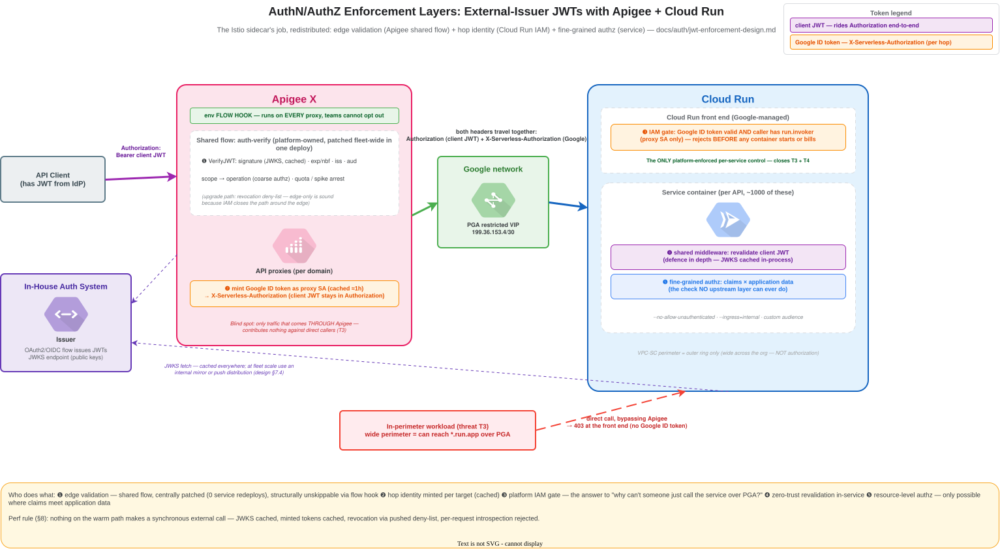
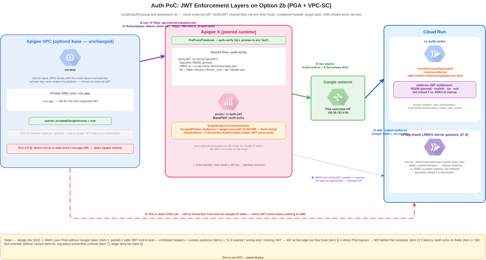

# AuthN/AuthZ Enforcement: External-Issuer JWTs with Apigee + Cloud Run

**Status: PoC executed live — §10 items 1–6 verified** (items 1–5 on
2026-07-30, greenfield project, option 2b perimeter enforced, 8/8
assertions; item 6 — the Envoy sidecar — in a follow-up live session,
6/6). This document
works out *where* token checks (signature, expiry, issuer, audience, scopes,
fine-grained authorization) should be enforced when the API platform is
Apigee → PGA → Cloud Run rather than GKE + Istio. Claims marked
**[VERIFY]** are unproven; claims marked **[VERIFIED]** were proven in the
live run — see [auth-poc-field-notes.md](auth-poc-field-notes.md) for the
full run log, failures and corrections.
[`scripts/auth/`](../../scripts/auth/README.md) builds the §9 baseline with
both in-service variants side by side and exercises §10 items 1–6 (see its
README for the mapping).





(Sources: [auth-enforcement-layers.drawio](../diagrams/auth-enforcement-layers.drawio),
[auth-poc-architecture.drawio](../diagrams/auth-poc-architecture.drawio))

**Scope and assumptions:**

- An **external auth system** (in-house IdP) issues JWTs to callers via a
  standard OAuth2/OIDC flow. The platform does not mint end-user tokens.
- Connectivity is Option B/2b: Apigee proxies reach Cloud Run over **PGA**
  inside a **VPC-SC perimeter** — but the perimeter is **wide** (spans many
  projects in the organisation). Perimeter membership must NOT be treated as
  authorization: an unrelated workload inside the perimeter can reach
  `*.run.app` over PGA and bypass Apigee entirely (§6).
- Target scale is **~1000 Cloud Run services**, so §7 treats operational
  concerns (ownership, patch propagation) as first-class design inputs, not
  afterthoughts.
- Builds on [path-routing-at-scale.md §4](../path-routing-at-scale.md)
  (the two auth scenarios) — this doc goes deeper on *where each individual
  check runs* and *who operates the machinery*.

---

## 1. The job Istio was doing

In a GKE world the answer is one word: the sidecar. It is worth being precise
about what that one component did, because every one of these jobs still has
to land somewhere:

| # | Check | Istio mechanism |
|---|---|---|
| 1 | JWT signature vs issuer JWKS (fetched + cached) | `RequestAuthentication` |
| 2 | Expiry (`exp`) / not-before (`nbf`) | `RequestAuthentication` |
| 3 | Issuer (`iss`) allow-list | `RequestAuthentication` |
| 4 | Audience (`aud`) match | `RequestAuthentication` |
| 5 | Scopes/claims → operation (method + path) | `AuthorizationPolicy` |
| 6 | Reject *before* app code runs | sidecar sits in the pod's network path |
| 7 | Uniform across every workload, no app-code change | injected at deploy; config is cluster-level |
| 8 | Centrally patchable | control-plane upgrade + pod restart |
| 9 | Workload-to-workload (hop) identity | mTLS / SPIFFE |

Rows 1–5 are token checks. Rows 6–9 are the *properties* that made the
sidecar model attractive: enforcement in the traffic path, uniformity,
central ownership, and a separate hop-identity layer. Apigee + Cloud Run has
no single component with all nine properties — the design below distributes
them across layers and then asks what that costs operationally.

## 2. Two tokens, two different questions

The design keeps two credentials rigorously separate; most confusion in this
space comes from conflating them:

| | Client JWT | Google ID token |
|---|---|---|
| Issued by | in-house auth system | Google (minted by Apigee per request) |
| Answers | "who is the **end user / client app**, what may they do?" | "is this hop **from Apigee**?" |
| Carried in | `Authorization: Bearer …` | `X-Serverless-Authorization` (to avoid clobbering — see below) |
| Validated by | Apigee (`VerifyJWT`) and/or the service | Cloud Run's front end (IAM), before any container runs |
| Lifetime | issuer policy (minutes–hours) | ~1 h, minted fresh by Apigee |

The Google token authenticates the *previous hop*; the client JWT
authenticates the *principal*. Neither substitutes for the other: a valid
Google token says nothing about the end user, and a valid client JWT says
nothing about whether the request actually came through Apigee (anyone
in-perimeter can replay a captured JWT directly at the service if only the
JWT is checked).

**Header collision:** Apigee's `<Authentication><GoogleIDToken>` block writes
`Authorization` by default — clobbering the client JWT. Cloud Run accepts the
Google token in `X-Serverless-Authorization` for exactly this case, and
Apigee's `<HeaderName>` element points the minted token there, leaving the
client JWT untouched in `Authorization`. **[VERIFIED]** — the bundle deploys
with `<HeaderName>` inside the target's `<Authentication>` block, Cloud Run
IAM accepts the Google token from `X-Serverless-Authorization`, the client
JWT arrives intact in `Authorization`, and (a bonus beyond the design's
minimum) Cloud Run forwards `X-Serverless-Authorization` through to the
container rather than stripping it.

## 3. Threat model

What the layered design must defeat:

| ID | Threat | Primary control |
|---|---|---|
| T1 | External caller with no/garbage token | Apigee `VerifyJWT` at the edge |
| T2 | Expired, wrong-audience, or out-of-scope (but well-formed) JWT | Apigee `VerifyJWT` + product scope check |
| T3 | **In-perimeter workload calls the service directly over PGA, bypassing Apigee** (valid stolen JWT or no JWT) | Cloud Run IAM — `run.invoker` restricted to the proxy SA (§6) |
| T4 | A service team ships a service with auth middleware missing/misconfigured | Cloud Run IAM again — the service is still closed at the Google layer; conformance checks (§7.5) |
| T5 | Compromised neighbouring service pivots east-west | per-service IAM (services do not share invoker grants) + service-side authz |
| T6 | Issuer key compromise / rotation mishap | operational: rotation runbook, JWKS cache TTL bounds (§7.4) |

T3 is the pivotal one: it is why "do all the checks in Apigee" is
insufficient no matter how good the Apigee policy is, and it can only be
closed by a control that Cloud Run itself enforces.

## 4. Enforcement point catalogue

What each available component *can* do, and where it is blind.

### 4.1 Apigee — `VerifyJWT` in a shared flow, attached via flow hooks

The natural home for checks 1–5 on the north-south path:

- `VerifyJWT` validates signature against the issuer's **JWKS** (`<JWKS
  uri>` with built-in caching), `exp`/`nbf` (with configurable clock skew),
  `iss`, `aud`, and arbitrary additional claims.
- Verified claims land in flow variables (`jwt.{policy}.claim.*`) for
  routing, quota keys, and header propagation.
- **Scope → operation** mapping: Apigee's native model is OAuth scopes on
  **API products**; with an external issuer the equivalent is a shared-flow
  step comparing the JWT `scope` claim against the required scope for the
  matched flow (per-operation attribute). Coarse-grained ("does this token
  carry `disputes.read`?"), not resource-grained.
- Packaged as a **shared flow** attached via **environment-level flow
  hooks**, it runs on *every* proxy in the environment — individual proxy
  teams cannot forget it or opt out. This is the closest analogue to
  Istio's "uniform, centrally owned" property (rows 7–8), and it is the
  single biggest operational win in the whole design: one deployment
  updates the fleet with **zero service redeploys** (§7.2).
- Also the right place for **SpikeArrest / Quota** keyed on a JWT claim
  (client id / subject), and for auditing (who called what).

**Blind spot:** only traffic that traverses Apigee. Contributes nothing
against T3. Apigee is a *policy* enforcement point, not a *reachability*
control.

### 4.2 Cloud Run IAM — the platform-enforced service boundary

`--no-allow-unauthenticated` + `roles/run.invoker` granted **only** to the
Apigee proxy's service account. Cloud Run's front end (GFE-side, before any
container starts or bills) validates the Google ID token in
`Authorization` or `X-Serverless-Authorization`.

- The **only per-service control the platform enforces regardless of what
  the service team ships**. Closes T3 and T4 — Istio row 6's "reject before
  app code" property, for the hop-identity layer.
- Cannot see the client JWT at all. It answers "is this Apigee?", never
  "is this Alice, with scope X?".
- Plumbing per target (from [field notes §3](../option-b-vpcsc-field-notes.md)):
  audience must match the service URL exactly, proxy SA needs `run.invoker`
  per service, Apigee service agent needs `tokenCreator` on the SA. At 1000
  services this is automation territory, not console territory. **Custom
  audiences** (`--add-custom-audiences`) let every TargetEndpoint use one
  fixed audience string instead of per-service URLs — **[VERIFIED]** as a
  scale simplification: the flag deploys cleanly and an Apigee-minted token
  with the fixed-string audience is accepted end-to-end.

### 4.3 Network layer — ingress + VPC-SC (outer ring only)

`--ingress=internal` plus the perimeter keeps the internet out and provides
data-exfiltration control. By stated assumption it is **not** an
authorization mechanism here: the perimeter is wide, so "in-perimeter" ≈
"somewhere in the org". Keep it, count it as defence in depth, and design
as if any org workload can open a TCP connection to any service.

### 4.4 In-service middleware — shared per-language library

A platform-owned library (JWT validation + claims → request context +
fine-grained authorization helpers) wired into every service's framework
stack:

- The **only** layer that can do **fine-grained / resource-level
  authorization**: "Alice may read *this* dispute because her `customer_id`
  claim matches the row". No gateway or sidecar can ever do this — it
  requires joining claims with application data. This layer exists in
  *every* pattern; the design choice is only how much *validation* it also
  repeats.
- Zero-trust posture: re-validating signature/expiry in-service costs
  little (JWKS cached in-process) and removes "trust whatever headers
  arrive" as a failure class.
- **Operational cost is the story**: one library per language × N languages,
  propagated by rebuild-and-redeploy of every consuming service (§7.2).

### 4.5 Cloud Run sidecar — the literal Istio analogue

Cloud Run supports **multi-container revisions with an ingress container**:
an Envoy (with the `jwt_authn` filter) or ESPv2 container receives traffic
and forwards to the app container over localhost. This reproduces Istio
rows 1–6 almost exactly, without app-code changes and identically across
languages.

- Enforcement is in the revision's traffic path — an app team cannot skip
  it *if* deploy tooling injects it (unlike Istio, there is no
  cluster-level injection: the "injection" point is the deploy pipeline,
  which becomes part of the trust story).
- One image to own instead of N libraries — but images are **pinned per
  revision**, so a patched sidecar still requires redeploying every
  service (§7.2). Fine-grained authz still lives in app code regardless.
- **[VERIFIED]** ingress-container + JWT-filter pattern works on Cloud Run
  (multi-container deploy, Envoy `jwt_authn` as the ingress container).
  Measured impact vs the library: ≈ +3–7 ms p50 warm (higher figure at
  0.25 vCPU). Cold start depends on topology: `--depends-on` serializes
  container starts and costs a flat +0.65 s, but with **parallel starts**
  (no depends-on; Envoy's startup probe traverses the proxy to the app via
  a JWT-exempt health route) Envoy's ~0.6 s init overlaps the app's own
  boot — measured marginal cost ≈ 0 for any app slower than Envoy itself.
  Size the sidecar explicitly: per-container defaults double the instance
  footprint; 0.25 vCPU/128 Mi was accepted with concurrency 80 intact.
  Note the rejection-code taxonomy differs: `jwt_authn` returns 401 for
  expired/missing but **403** for audience mismatch, where Apigee VerifyJWT
  and the library return 401 across the board.

  The verified flow is documented hop-by-hop — sequence diagram, wire-level
  headers with decoded example tokens, per-layer rejection matrix — in
  [envoy-sidecar-flow.md](envoy-sidecar-flow.md).

### 4.6 Considered and rejected

| Component | Why not |
|---|---|
| **IAP** | Built around Google identities / Workforce Identity Federation; the requirement is an in-house issuer's JWT as the primary credential. Federating everything through Google identity is a bigger architectural change than this design assumes. |
| **Cloud Armor** | No JWT validation capability; also sits on external LBs, which this topology doesn't use. |
| **API Gateway / ESPv2 as a separate proxy layer** | A second gateway product alongside Apigee duplicates the edge; ESPv2 only makes sense here in the §4.5 sidecar position. |
| **mTLS Apigee→Cloud Run** | Google's front end terminates TLS for `run.app`; custom client certs can't reach the service. Hop identity is tokens (Google ID token), not certs. |

## 5. The checks matrix

Where each check *can* run (✓), where it *cannot* (✗), and where the design
says it **must** run (bold):

| Check | Apigee (shared flow) | Cloud Run IAM | Sidecar | App middleware |
|---|---|---|---|---|
| Client JWT signature vs JWKS | **✓ must** | ✗ | ✓ | ✓ defence in depth |
| Client JWT `exp` / `nbf` | **✓ must** | ✗ | ✓ | ✓ defence in depth |
| Client JWT `iss` | **✓ must** | ✗ | ✓ | ✓ defence in depth |
| Client JWT `aud` (API audience) | **✓ must** | ✗ | ✓ | ✓ defence in depth |
| Scopes → operation (coarse authz) | **✓ must** (product/flow mapping) | ✗ | ✓ (path-level) | ✓ |
| Fine-grained / resource authz | ✗ | ✗ | ✗ | **✓ only possible here** |
| Hop authentication ("came via Apigee") | ✗ (it *is* the hop) | **✓ must** | partial¹ | partial¹ |
| Rate limiting / quota per client | **✓ must** | ✗ | ✓ crude | ✗ practical |
| Revocation / issuer deny-list | ✓ best placed² | ✗ | ✓ | ✓ |
| Audit of authn decisions | **✓** + | ✓ (audit logs on denial) | ✓ | ✓ |

¹ A sidecar or app *can* also validate the Google ID token from
`X-Serverless-Authorization`, but Cloud Run IAM has already done so
platform-side; re-checking adds little.
² Tiered: TTL bound → edge deny-list → introspection; see §7.7. The edge
is the one place a revocation check runs once per request rather than per
service.

Reading of the matrix: **every token check lands in Apigee; the bypass
problem lands on Cloud Run IAM; fine-grained authz lands in the app; the
open design choice is only whether validation is *repeated* service-side by
a library (§4.4) or a sidecar (§4.5).**

## 6. Closing the direct-PGA bypass (T3)

The question posed at the outset: if checks live in Apigee, what stops
someone inside the (wide) perimeter calling `https://svc-xyz.run.app`
directly? Ranked by strength:

1. **Cloud Run IAM (`--no-allow-unauthenticated`, invoker = proxy SA
   only)** — platform-enforced, per-service, identity-based. A direct
   caller without a Google ID token minted from *that specific SA* gets a
   403 from Cloud Run's front end; the container never runs. This is the
   design's answer. It also means the **pure scenario-B posture
   (`--allow-unauthenticated` + JWT-only, from path-routing §4) is ruled
   out at this trust level** — it leaves every service one forgotten
   middleware away from open-to-the-org (T4).
2. `--ingress=internal` — keeps the internet out; does nothing against
   in-perimeter callers.
3. VPC-SC — org-boundary control; wide by assumption.
4. Obscurity of `run.app` URLs — not a control (URLs leak via logs, DNS,
   config repos).

Residual risk after (1): a caller who can impersonate the Apigee proxy SA
(has `tokenCreator` on it) can bypass Apigee's policy checks. That
concentrates the review surface onto **IAM grants on one SA** (or a few,
per environment) — auditable, alertable, and far smaller than "anything in
the perimeter". Optionally segment proxy SAs per domain so a compromise
doesn't unlock all 1000 services. **[VERIFIED]** the 403-before-container
behaviour from an in-perimeter VM: no token → 403, valid *client* JWT →
401, both served by the Cloud Run front end with no container instance
started; signature in §7.6.

## 7. Operating this at ~1000 services

### 7.1 Ownership model

| Actor | Owns | Security-fix blast radius |
|---|---|---|
| **Identity team** | The external issuer, signing keys, JWKS endpoint, token TTL/claims schema, rotation calendar | Issuer-side only (until a claim schema change — that ripples everywhere) |
| **Apigee platform team** | The auth **shared flow**, flow-hook attachment, scope→operation mapping data, quota policy | Redeploy one shared flow per environment |
| **App platform team** | Middleware libraries (per language) and/or the sidecar image; base images; deploy tooling that injects/pins them; conformance checks | Rebuild/redeploy up to 1000 services |
| **App teams (~50 domains)** | Fine-grained authz logic, correct middleware wiring, service IAM posture (from templates) | Their own services |

The wrong ownership answer at this scale is "each app team maintains its own
JWT code" — 1000 hand-rolled validators is 1000 places for the same CVE.

### 7.2 Patch propagation — the deciding operational comparison

What happens when a security fix (JWT library CVE, algorithm-confusion
class bug, new required claim) must roll out:

| Mechanism | Update action | Service redeploys needed | Fleet-wide latency | Failure isolation |
|---|---|---|---|---|
| **Apigee shared flow** | deploy new shared-flow revision per env | **0** | minutes | one change affects all traffic at once — needs canary env / preprod soak |
| **Sidecar image** | publish patched image | **all ~1000** (images pin per revision) | days–weeks without automation | per-service rollout, can canary |
| **Per-language library** | publish N library versions | **all ~1000**, gated on each team's rebuild | weeks–months tail without forcing functions | per-service |
| Cloud Run platform / IAM | Google's job | 0 | n/a | n/a |

Consequences:

- **Put every check that can live in the shared flow, in the shared flow.**
  It is the only mechanism with Istio-like central patchability.
- Any service-side mechanism (library *or* sidecar) makes "redeploy the
  fleet" a routine platform operation. That machinery — config-as-code
  service definitions, CI fan-out, staged rollout, and a dashboard of "who
  is on which middleware/sidecar version" — is a **prerequisite**, not a
  nice-to-have. (Istio had the same property hidden inside "restart the
  pods"; Cloud Run just has no `kubectl rollout restart` for 1000
  services.)
- Version skew is therefore permanent background state. The conformance
  check (§7.5) must report versions, and the platform team needs an agreed
  "minimum supported middleware version" policy with teeth (CI gate).

### 7.3 Choosing library vs sidecar for the service-side layer

| Driver | Favours |
|---|---|
| Polyglot estate (many languages) | **Sidecar** — one image vs N libraries |
| Mostly one/two languages with strong shared framework | **Library** — no extra hop, no second container's memory/CPU, simpler local dev |
| Fine-grained authz complexity (claims deep in business logic) | Library involved either way — sidecar never removes the in-app layer (§5), it only de-duplicates *validation* |
| Cold-start / latency sensitivity | Library (sidecar adds a proxy hop + container start). **[VERIFIED]** magnitude: hop ≈ +3–7 ms p50 warm; container start ≈ +0.65 s only if serialized with `--depends-on` — with parallel starts + a through-proxy readiness probe it overlaps the app's boot (measured ≈ 0 marginal for an app slower than Envoy) |
| Trust in deploy tooling to inject uniformly | Sidecar needs it; library needs the same discipline via build tooling |

Given Cloud Run IAM already guarantees requests came through Apigee (which
performed full validation), the service-side layer is defence in depth plus
claims extraction — not the primary gate. The §10 item 6 measurements
settled the latency question: a tuned parallel-start sidecar costs a few
warm milliseconds and ≈ 0 marginal cold start, so the deciding costs are
operational (image ownership, per-revision pinning, explicit sizing), not
performance. **Default recommendation is the sidecar** — enforcement is
language-independent, config-not-code, and one image to patch instead of N
libraries — with the **library as a full-peer alternative** where the
estate is effectively one or two languages with a strong shared framework
(in-process, no proxy hop, no second container, simpler local dev). Both
are production candidates; §9 shows the sidecar-first shape, and the PoC
deploys and tests both side by side.

### 7.4 JWKS distribution, fetch amplification, and key rotation

**Who fetches the JWKS, and how many of them are there?** Istio hid this
problem: **istiod** fetches the issuer's JWKS once per control plane and
*pushes* the keys to every sidecar as config — the issuer sees O(1)
fetchers regardless of pod count or churn. Neither platform here
reproduces that shape:

| Validation layer | JWKS cache lives in | Fetcher population | Churn |
|---|---|---|---|
| Istio (reference) | istiod, pushed to sidecars | O(control planes) | none — pods never fetch |
| Apigee `VerifyJWT` | message processor, cached | O(MPs) — small, bounded | low (long-lived) |
| Cloud Run in-service | **per container instance**, in-process only | O(live instances), fleet-wide | **high** — scale-to-zero, burst autoscale, instance recycling, deploy waves |

Apigee is a non-issue: a handful of long-lived MPs with policy-level
caching (**[VERIFY]** exact TTL and configurability). Cloud Run is the
concern — every new instance does a cold JWKS fetch, usually on the
critical path of its first request. Steady-state *volume* is actually
trivial (even 10k instance starts/hour ≈ 3 small GETs/sec against the
issuer); the real problems are structural:

1. **Correlated bursts** — a fleet-wide middleware patch (§7.2's 1000
   redeploys) or a traffic spike synchronises thousands of cold fetches.
2. **Availability coupling** — warm instances survive an issuer JWKS
   outage on cached keys, but *new* instances fail closed. An issuer blip
   during an autoscale event silently becomes a serving outage for
   whatever scaled.
3. **Cold-start latency** — an external fetch through the egress path
   added to first-request latency, per instance.
4. **Egress surface** — 1000 services each needing external egress to the
   issuer, just for JWKS (one more entry in the
   [governed allow-list](../option-b-vpcsc-field-notes.md)).

Mitigations, in rough order of preference:

- **Internal JWKS mirror** — a tiny platform-owned Cloud Run service that
  fetches from the issuer and serves the keys in-perimeter. This is
  *recreating istiod's role*: the issuer sees O(1) fetchers again, egress
  is needed from one place only, and the mirror can serve **stale-on-error**,
  which breaks the availability coupling (2). Cost: a new critical
  dependency with an owner, SLO, and monitoring — but a ~static-file
  service with aggressive caching is about the easiest SLO on the
  platform. **Partially [VERIFIED]**: an `ingress=internal` mirror is
  reachable in-perimeter over PGA (VM) and by the Apigee runtime (via the
  tenant's peered DNS → restricted VIP), but a *no-VPC-egress Cloud Run
  consumer* cannot reach it — its fetch egresses to the public frontend
  and 404s in ~75–100 ms (fail-fast). Mirror consumers therefore need VPC
  egress, or the push/env-fallback pattern below.
- **Push distribution** — publish the JWKS into Secret Manager and have
  services resolve it as a secret reference at instance start: the
  per-instance fetch goes to Google infrastructure instead of the issuer,
  and no service needs external egress. Cost: rotation becomes a *push
  pipeline* (identity team publishes → pipeline updates the secret) that
  must be reliable, and stale-key detection needs monitoring.
- **CDN in front of the issuer's `jwks_uri`** — what the large public
  IdPs do; fixes issuer load and mostly (2)/(3), but leaves the
  per-service egress requirement (4) in place.
- **Middleware discipline** — whichever source is used: eager fetch at
  startup (moves latency off the first request), background refresh,
  rate-limited re-fetch on unknown-`kid`, serve-stale-while-revalidating.
  This is exactly the kind of behaviour the shared library (§4.4) exists
  to make uniform.
- `min-instances > 0` on latency-critical services reduces churn but is a
  cost trade, not a fix.

**Cache TTLs and rotation.** Cache TTLs bound two things: how fast a *new*
signing key becomes usable (rotation) and how long a *revoked* key keeps
verifying (compromise). Agree TTLs with the identity team — noting that
with a mirror or push model the effective TTL is mirror/pipeline refresh +
in-process cache. Rotation runbook: publish new key in JWKS → wait > max
end-to-end cache TTL → start signing with it → retire the old key after
token max-age.

**Issuer outage policy**: fail-closed when keys are unrefreshable *and*
expired — stated up front, with the stale-on-error mirror as the mechanism
that makes brief issuer outages a non-event rather than a fleet incident.

### 7.5 Enforcement of the enforcement

At 1000 services, "the design says IAM-closed" is worthless without
verification that reality matches:

- **Flow hooks** make the Apigee side structural — proxies cannot skip the
  shared flow. Nothing equivalent exists for Cloud Run flags, so:
- **Conformance-as-code**: a periodic audit (Cloud Asset Inventory query or
  script) asserting for every service: `--no-allow-unauthenticated`, no
  `allUsers`/broad invoker bindings, `ingress=internal`, expected SA
  pattern, middleware/sidecar version ≥ minimum. Violations page the
  platform team. This audit is a prime candidate for the first tests in
  `scripts/auth/`.
- **Org policy** where possible: e.g. Domain Restricted Sharing blocks
  `allUsers` grants org-wide (kills accidental
  `--allow-unauthenticated`-equivalent IAM). **[VERIFY]** which postures
  can be made *preventive* via org policy vs merely *detective* via audit.
- Deploy templates: app teams deploy from golden pipeline templates that
  set the flags and inject the middleware — conformance drift then implies
  someone went around the pipeline, itself a signal.

### 7.6 Observability of auth decisions

| Failure | Where it appears |
|---|---|
| Bad/expired/out-of-scope JWT | Apigee: 401/403 in analytics + policy fault variables; alert on rate spikes (credential-stuffing signal) |
| Direct-call attempt (T3) | Cloud Run request log: 403, no container instance started. **[VERIFIED]** exact signature: `run.googleapis.com%2Frequests` log, `httpRequest.status=403`, textPayload "The request was not authenticated ... Empty Authorization header value" (401 variant when a non-Google bearer token is presented). No Admin Activity audit entry — detection is a log-based metric on the request log |
| Service-side validation failure while Apigee passed it | Service logs — should be **near-zero**; non-zero means skew between edge and service validation configs (alert) |
| JWKS refresh failures | Apigee policy faults / middleware logs — leading indicator of a looming fail-closed event |

### 7.7 Revocation — how fast can access be killed?

A JWT is a bearer credential validated **offline**: between issuance and
`exp`, nothing in the request path consults the issuer. "Revocation" is
therefore not one mechanism but a tiered trade of latency vs cost:

| Tier | Mechanism | Revocation latency | Per-request cost | Operated by |
|---|---|---|---|---|
| 0 | Short access-token TTL; revocation enforced at the **refresh** boundary (issuer refuses to refresh a killed session) | worst case = remaining TTL | zero | identity team (issuer policy) |
| 1 | **Deny-list at the Apigee edge** (`jti` / `sub` / client id) in the auth shared flow | list propagation (seconds–minutes) | one cache/KVM lookup | identity team publishes; Apigee platform team enforces |
| 2 | Per-request introspection (RFC 7662) | ~zero | issuer round-trip on **every** request; issuer becomes a per-request availability dependency | rejected as a default |

**Is tier 0 alone enough?** For logout and routine session termination,
usually yes — 5–15 minutes of residual access is a commonly accepted
bound, *provided* refresh-token revocation is actually enforced
issuer-side (worth stating as an explicit requirement on the identity
team, not an assumption). For compromise response — stolen token detected,
client credential leaked — "attacker keeps access until `exp`" is a
risk-appetite decision per operation class, not a platform decision. The
platform's job is to state the bound precisely so risk owners can accept
or reject it. Note the TTL dial isn't free: shorter tokens mean more
refresh traffic and tighter coupling to issuer availability (§7.4's
trade, one layer up).

**Tier 1 is this design's upgrade path, and it is unusually cheap here.**
Because Cloud Run IAM closes the direct-PGA bypass (§6), every request
provably traverses Apigee — so a deny-list check in the shared flow
covers the entire fleet at **one** enforcement point, with zero changes
to the 1000 services. This is a structural payoff of the layered design
worth naming: *stateful or expensive checks can be edge-only, because the
platform guarantees there is no path around the edge.* The list also
stays small: an entry only needs to live until its token's `exp`, so
short TTLs (tier 0) and the deny-list (tier 1) are complements — tier 0
caps list size, tier 1 caps revocation latency. Distribution reuses the
§7.4 machinery (mirror or push). **[VERIFY]** lookup mechanism and added
latency in the shared flow (KVM vs cache vs ExternalCallout).

**Tier 2 stays rejected as a default** — it converts stateless JWT
validation back into a per-request issuer dependency at fleet scale. For
the small class of genuinely high-risk operations, prefer a **freshness
requirement** instead: the shared flow (or the service) demands
`auth_time`/`iat` newer than N minutes — or a step-up claim — for those
specific operations. That narrows the stolen-token window where it
matters without shortening every token's TTL or introspecting every call.

**Mass revocation** (issuer key compromise) is not token revocation at
all — it is key rotation (§7.4): pull the key from the JWKS and every
token signed by it dies as caches refresh; latency = max end-to-end JWKS
cache TTL.

## 8. Performance considerations

Auth is on the hot path of every one of the fleet's requests, so its cost
model deserves the same scrutiny as its security model. The short version:
steady-state the design adds **low single-digit milliseconds**; every
mechanism that could break that property has already been rejected or
cached, and the risks that remain are concentrated in **cold paths** and
in **shared-flow regressions multiplying across the fleet**.

### 8.1 The per-request auth tax (warm path)

| Stage | Work done | Expected warm cost |
|---|---|---|
| Apigee shared flow: `VerifyJWT` | RS256 signature verify + claim checks, JWKS from MP cache | ~1–5 ms policy execution **[VERIFY]** (not isolated by the PoC: the flow hook applies VerifyJWT to the baseline path too, so the measured delta excludes it; end-to-end p50 with VerifyJWT was 24–25 ms VM→Apigee→Cloud Run) |
| Scope → operation check | flow-variable comparison (or cached KVM read) | negligible |
| Deny-list lookup (§7.7 tier 1, if adopted) | local KVM/cache read | ~ms — the `ExternalCallout` variant adds a network RTT per request, which is why lookup mechanism is a **[VERIFY]** item |
| Google ID token mint | Apigee caches minted tokens until near expiry — amortised ≈ 0; first request per target/SA pays an IAM round trip. **[VERIFIED]** consistent with ≈ 0 amortised: mint+IAM+middleware added ~1 ms at p50 over the VerifyJWT-only path (N=15, warm) | ≈ 0 amortised |
| Cloud Run IAM check | Google-side at the front end, before the container | negligible (platform claim — not separately measurable) |
| Service middleware revalidation | in-process signature verify, JWKS already in memory | tens–hundreds of µs |

**The design rule that keeps this true: nothing on the warm path makes a
synchronous external call.** JWKS is cached (§7.4), minted Google tokens
are cached, the deny-list is pushed not pulled, and per-request
introspection was rejected (§7.7) on exactly this ground. Perf and
availability turn out to be the same argument — every cache above is also
the thing that survives an issuer blip.

### 8.2 Cold paths — where the tail latency lives

- **Instance cold start + JWKS fetch** (§7.4): the fetch lands on the
  first request of every new instance, *compounding* with Cloud Run's own
  cold start — the same request pays both. Eager fetch at startup and the
  internal mirror shrink this; it never disappears.
- **First-call token mint** per target after an Apigee cache miss/expiry.
- **Sidecar variant** (§4.5): **[VERIFIED]** the localhost hop costs
  ≈ +3–7 ms p50 warm (higher figure at 0.25 vCPU — mild throttling on the
  RS256 verify), and with parallel container starts the cold-start cost
  measured ≈ 0 marginal — Envoy's ~0.6 s init overlaps the boot of any app
  at least that slow (the +0.65 s first measured was the `--depends-on`
  serialization, not the sidecar itself). What remains real fleet-wide is
  the per-instance footprint (0.25 vCPU/128 Mi when sized explicitly;
  per-container defaults silently double it) and the warm milliseconds —
  cold start is no longer an argument against the sidecar.
- p50 barely moves from any of this; **p99 is where the auth design shows
  up**, and it shows up on exactly the requests already paying cold-start
  cost. Benchmark cold and warm separately or the numbers will lie.

### 8.3 Fleet-scale multipliers

- **The shared flow runs on every request of every proxy** (that is the
  point of the flow hook) — so a 2 ms regression in it is 2 ms across all
  1000 services simultaneously. Treat shared-flow latency as a
  platform-owned SLO: p50/p95/p99 dashboards, and a latency regression
  gate on shared-flow changes alongside the §7.2 canary discipline.
- **Apigee capacity**: `VerifyJWT` is CPU on the message processors;
  include auth CPU in TPS sizing rather than discovering it at the first
  load test.
- **Token size**: every request now carries two bearer tokens (~1–2 KB
  each). No practical header-limit risk, but fat scope lists and claim
  sprawl bloat every request, log line, and analytics record on the
  platform — a lean claims schema (§10 open item) is a perf item, not
  just hygiene.
- **Rate limiting**: `SpikeArrest` is MP-local and cheap; distributed
  `Quota` synchronises counters — use asynchronous quota accounting
  unless a hard global limit genuinely matters.

### 8.4 Signature algorithm note

RS256 verification is cheap (small public exponent) and verify-heavy is
exactly this fleet's profile; ES256 gives smaller tokens but costlier
verification. Either is fine at these volumes — the rule that matters is
**pin the expected algorithm** in both `VerifyJWT` and the middleware
(never accept `alg: none` or issuer-driven algorithm switching), which is
simultaneously the defence against algorithm-confusion attacks. Perf and
security agree again.

## 9. Resulting shape (recommended baseline)

```
Client ──JWT──► Apigee env (flow hook → auth shared flow)
                 │  VerifyJWT: sig, exp/nbf, iss, aud   ← T1, T2
                 │  scope→operation check, quota
                 │  mint Google ID token ─► X-Serverless-Authorization
                 │  client JWT untouched ─► Authorization
                 ▼
               PGA / restricted VIP  (perimeter = outer ring only)
                 ▼
Cloud Run front end: IAM validates Google token            ← T3, T4
  (--no-allow-unauthenticated, invoker = proxy SA, ingress=internal)
                 ▼
Envoy sidecar (ingress container): jwt_authn re-validates
  the client JWT before app code runs                       ← T4/T5's
  (defence in depth — config, not code)                        validation half
                 ▼ localhost
App container: extracts claims → fine-grained resource
  authz (the check nothing upstream can ever do)            ← row 5's deep half
```

- Apigee shared flow = the Istio `RequestAuthentication` + coarse
  `AuthorizationPolicy`, centrally patchable, structurally unskippable.
- Cloud Run IAM = the reachability gate Istio got from mTLS — and the
  answer to "why can't someone just call it over PGA".
- Envoy sidecar (ingress container) = the primary in-service validation
  layer: zero-trust re-check in the revision's traffic path,
  language-independent, one image fleet-wide, no app-code changes.
  **Full-peer alternative: the shared per-language library** (§4.4) —
  in-process (no proxy hop, ≈ 3–7 ms cheaper at p50 warm, no second
  container to size), at the cost of one implementation per language and
  rebuild-to-patch. Both are production candidates; §7.3 gives the
  deciding drivers.
- Fine-grained resource authz stays in app code in either variant.
- Everything service-side rides on fleet-redeploy automation and
  conformance auditing, which are part of the design, not ops detail.

## 10. Open questions / PoC target list

1. **[VERIFIED]** `X-Serverless-Authorization` + `Authorization` combined
   pattern end-to-end: Google token accepted from the custom header, client
   JWT arrived intact, and the custom header was forwarded to the container.
2. **[VERIFIED]** Direct PGA call from an in-perimeter VM → 403 (no token)
   / 401 (client JWT) before container start; signature captured in §7.6
   (platform request log, not audit log).
3. **[VERIFIED]** (core) `VerifyJWT` shared flow via env flow hook: default
   `Source` reads the `Authorization` Bearer token; rejects expired
   (`steps.jwt.TokenExpired`), wrong-`aud` (`steps.jwt.InvalidClaim`) and
   missing (`steps.jwt.FailedToResolveVariable`) tokens with 401 at the
   edge. Crude latency (N=15): full path p50 25 ms vs VerifyJWT-only
   p50 24 ms — mint+IAM+middleware ≈ 1 ms at p50. Still open from this
   item: isolated VerifyJWT cost, p99, cold/warm split, JWKS cache TTL.
   Live corrections found: flow hook ID is `PreProxyFlowHook` (exact
   casing), and shared flows need an INTERMEDIATE (not BASE) environment.
4. **[VERIFIED]** (partial, per §7.4) JWKS distribution: Apigee fetches the
   mirror's JWKS through the tenant peered DNS → restricted VIP; a
   no-VPC-egress Cloud Run consumer gets a fast 404 from the public
   frontend (~75–100 ms) and must use env/push fallback — which the PoC
   exercises (`jwks_source:"env"`, fail-closed if neither loads). Still
   open: mirror stale-on-error prototype.
5. **[VERIFIED]** Custom audiences (`--add-custom-audiences`) collapse
   per-service audience plumbing to one fixed string, end-to-end.
6. **[VERIFIED]** Sidecar (ingress-container Envoy `jwt_authn`) works on
   Cloud Run — since promoted to the §9 primary in-service layer, deployed
   by the standard `scripts/auth/setup.sh` alongside the library peer and
   exercised by the standard suite (`test.sh` E1–E3, 6/6 on the live run):
   valid token passes with the client JWT intact; expired/missing → 401,
   wrong-aud → 403 (Envoy's taxonomy). Cost vs library, tuned: ≈ +3–7 ms
   p50 warm, ≈ 0 marginal cold start with parallel container starts (the
   +0.65 s first measured was the `--depends-on` topology, not the sidecar;
   a heavy-app emulation showed Envoy's init fully absorbed by the app's
   boot window), instance footprint +0.25 vCPU/128 Mi when sized (defaults
   silently double it). These measurements are what flipped §7.3/§9 to
   sidecar-first: the library keeps its in-process simplicity edge and
   stays a full peer, but language-independence and config-not-code now
   win by default.
7. **[VERIFY]** Preventive controls: which of the §7.5 postures can org
   policy enforce vs audit-only?
8. **[VERIFY]** Edge deny-list (§7.7 tier 1): lookup mechanism in the
   shared flow (KVM vs cache vs ExternalCallout), propagation latency
   from publish to enforced, and added per-request latency.
9. Open: proxy-SA segmentation granularity (one per env vs per domain) —
   trade blast radius against IAM-plumbing volume.
10. Open: issuer claims schema — is there a stable tenant/subject claim
    the fine-grained layer can rely on across all 1000 services?
11. Open: revocation SLO per operation class (§7.7) — agree with risk
    owners what residual-access bound is acceptable (worst case = access
    TTL at tier 0), and whether refresh-token revocation is enforced
    issuer-side today.
