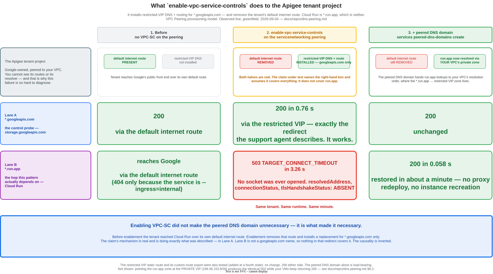

# Apigee X → Cloud Run under VPC Service Controls: the tenant DNS peering is required

**For:** a Google Customer Engineer or support engineer assessing the claim below.
**Status:** refuted live, greenfield, 2026-09-04. One follow-up question remains open (§7).
**Provisioning model:** Apigee X, **VPC Peering** (not PSC). This distinction decides which
mechanism applies and is the single most load-bearing fact on this page.

---

## 1. The claim

> "The peered DNS domain and the network routes aren't required if VPC Service
> Controls is enabled, because enabling it redirects the DNS to
> `restricted.googleapis.com` anyway."

— reported from a Google support agent, 2026-09.

## 2. The answer, in one paragraph

**The mechanism described is real. It does not cover `run.app`.**
`gcloud services vpc-peerings enable-vpc-service-controls` does install
restricted-VIP DNS and routing inside the Apigee tenant project — **for
`*.googleapis.com` names**. Cloud Run is reached at `*.run.app`, which is not one
of them. Worse, the same call **removes the tenant project's default internet
route**, which is the route the tenant had been using to reach Cloud Run. So
enabling VPC-SC does not make the peered DNS domain unnecessary — **it is what
makes it necessary.** The causality in the claim is inverted.

Without the peered DNS domain, every Apigee southbound call to Cloud Run fails
with `503 TARGET_CONNECT_TIMEOUT` at roughly 3.3 s, having never opened a socket.
Adding the peered DNS domain restores connectivity in about a minute, with no
proxy redeploy and no instance recreation.



(Source: [tenant-dns-under-vpcsc.drawio](../diagrams/tenant-dns-under-vpcsc.drawio))

## 3. Why the probes are paired — the discriminator

A single failing `run.app` probe proves only "the tenant cannot reach this". It
cannot distinguish *"the tenant has no DNS or routing at all"* from *"the tenant
has no DNS or routing **for this name**"* — and the entire disagreement lives in
that gap.

So every observation below probes **two hostnames through the same Apigee runtime
within the same minute**:

| Probe | Target | What it tests |
|---|---|---|
| `/hello` | `https://<svc>.run.app` | Cloud Run — the hop this pattern depends on |
| `/gapi-probe` | `https://storage.googleapis.com/...` | a `*.googleapis.com` name — the redirect the claim describes |

If the `googleapis` probe succeeds while the `run.app` probe cannot open a socket,
then the claim's mechanism is demonstrably **working** and demonstrably **not
covering Cloud Run**. That is a far more useful finding than "support was wrong",
and it is what we observed.

A VM in the customer VPC probes alongside as a control. The VM keeps its own
default route and its own view of the private DNS zone, so it keeps working
throughout — VM healthy while Apigee fails is the signature of a *tenant*
DNS/routing gap rather than anything in your VPC.

## 4. What we observed

Greenfield run, 2026-09-04, on a stack that **never had** the DNS peering — built
with the omission in place rather than broken afterwards. Each row adds one
thing. `cr-hello` ingress is a column, not a constant, because it turned out to
matter independently (§6.1); compare rows at equal ingress.

| # | State | ingress | Apigee → `*.run.app` | Apigee → `storage.googleapis.com` | VM control |
|---|---|---|---|---|---|
| 0 | Baseline: **no** VPC-SC, no plumbing | `internal` | `404` in 0.36 s (public GFE) | `200` | `200` |
| 1 | `enable-vpc-service-controls` only | `internal` | **`503` `TARGET_CONNECT_TIMEOUT` in 3.26 s** | `200` in 0.76 s | `200` |
| 2 | + `dns.peer` + peered DNS domain | `internal` | **`404` in 0.067 s** (connected) | `200` | `200` |
| 3 | (row 2 unchanged) | **`all`** | **`200` in 0.058 s** | `200` | `200` |
| 4 | + restricted-VIP route + custom route export | `all` | `200` in 0.060 s — **no change** | `200` | `200` |
| 5 | (row 4 unchanged) | `internal` | `404` in 0.049 s | `200` | `200` |

**Row 1 is the whole argument in one line.** The `googleapis` probe returns `200`
through exactly the redirect the support agent describes, in the same minute that
the `run.app` probe cannot open a socket at all.

**Row 1 against row 0 inverts the claim.** Before enablement the tenant reached
Cloud Run over its own default internet route. Enablement removed that route and
installed a replacement for `googleapis.com` only.

**Row 4 against row 3 retires a piece of our own earlier advice.** The
restricted-VIP static route and its custom-route export change nothing. We had
previously documented all four pieces as required; on a stack that never had
them, they demonstrably are not. What is load-bearing is the **peered DNS
domain** alone.

The Apigee debug session at row 1 shows the no-socket signature exactly —
`resolvedAddress`, `connectionStatus` and `tlsHandshakeStatus` are not wrong,
they are **absent**:

```text
error.class = com.apigee.errors.http.server.ServiceUnavailableException
error.state = TARGET_REQ_FLOW
state       = TARGET_REQ_FLOW
```

## 5. What it takes to reproduce

### 5.1 The minimum that demonstrates the claim

The result above needs **no VPC-SC perimeter** — only `enable-vpc-service-controls`
on the servicenetworking peering. That matters for anyone reproducing it, because
creating a perimeter requires org-level `roles/accesscontextmanager.policyAdmin`,
which is often the hardest prerequisite to obtain. It is not on this critical path.

| # | Resource | Notes |
|---|---|---|
| 1 | A VPC (`apigee-vpc`) + subnet with Private Google Access enabled | the Apigee `authorizedNetwork` |
| 2 | Reserved peering range + instance range | `/20` and `/22` respectively |
| 3 | Apigee X org + instance + environment + env group, **VPC Peering model** | ~60–90 min; the console's "Set up with defaults" gives you **PSC** — choose "Customise your setup" and select VPC Peering |
| 4 | A Cloud Run service | any container; `--ingress=all` for the cleanest signal (see §6.1) |
| 5 | An Apigee pass-through proxy targeting the service's `run.app` URL | with `<Authentication><GoogleIDToken><Audience>` for an authenticated target |
| 6 | Private Cloud DNS zone: `*.run.app` → `199.36.153.4-7` | the **restricted** VIP — see §6.2, this one bites |
| 7 | Private Cloud DNS zone for `googleapis.com` | required because the `run.app` records are CNAMEs |
| 8 | A test VM in the same VPC | the control probe |
| 9 | `gcloud services vpc-peerings enable-vpc-service-controls` | **the mechanism under test** |
| 10 | `roles/dns.peer` for `service-<num>@gcp-sa-apigee.iam.gserviceaccount.com` | a *prerequisite* — it activates nothing on its own |
| 11 | `gcloud services peered-dns-domains create run-app --dns-suffix=run.app.` | **the thing in dispute** |

Items 1–9 produce the failure. Item 11 fixes it. Item 10 must precede item 11.

### 5.2 Cost and time

| | |
|---|---|
| Apigee provisioning | ~60–90 min (org ~40 min, instance ~45 min) |
| Apigee runtime, pay-as-you-go | $0.50/hr — dominates everything else |
| Everything else (DNS zones, `e2-micro`, Cloud Run at zero scale) | ~$0.01/day |
| Peered DNS domain pickup by the runtime | minutes; no redeploy, no instance recreation |
| A useful test window | ~6 hours, ~$3–5 |

An Apigee **eval** org carries no licence charge for 60 days and supports the VPC
Peering model, but cannot be converted to a paid org.

### 5.3 If you want to run our scripts

They exist, but they are shaped for our sandbox, not yours —
[`scripts/option2/`](../../scripts/option2/) and
[`scripts/option2b/`](../../scripts/option2b/), driven by
[`scripts/option2b/experiment-tenant-dns.sh`](../../scripts/option2b/experiment-tenant-dns.sh),
which builds the omitted state deliberately and adds the pieces back one at a
time:

```bash
export PROJECT_ID=<your-project>

SKIP_RESTRICTED_VIP_ROUTE=1 ./scripts/option2b/setup-early.sh
SKIP_TENANT_DNS=1           ./scripts/option2b/setup-finish.sh

./scripts/option2b/experiment-tenant-dns.sh omit   # expect: run.app FAILS
./scripts/option2b/experiment-tenant-dns.sh dns    # expect: run.app WORKS
./scripts/option2b/experiment-tenant-dns.sh full   # expect: no further change
```

Things you would have to change: `REGION` (`europe-north2`), the Apigee API
endpoint (`https://eu-apigee.googleapis.com/v1`), and the external Cloud Run URLs
and project number in [`scripts/shared/env.sh`](../../scripts/shared/env.sh),
which point at our own projects and exist only for an unrelated egress-governance
test. `VM_CHANNEL=metadata` works around a sandbox whose egress policy blocks IAP.

## 6. The mechanism, precisely

`enable-vpc-service-controls` on the servicenetworking peering does three things,
and the third is the one the docs under-sell:

1. Places Apigee tenant southbound traffic inside your perimeter (the documented purpose).
2. Installs restricted-VIP DNS **and** routing inside the tenant, **for `*.googleapis.com`**.
3. **Removes the tenant project's default internet route.**

`run.app` is served by (3) and not by (2), so it is stranded. The tenant resolves
your Cloud Run URL to its public IPs and has no route to them. No amount of
waiting fixes this; it is not a propagation state.

Two mechanisms exist to peer DNS into the customer VPC, and they are **mutually
exclusive by provisioning model**:

| Provisioning model | Mechanism |
|---|---|
| **VPC Peering** (this document) | servicenetworking **peered DNS domain** — `gcloud services peered-dns-domains create` |
| **PSC (non-peering)** | the Apigee `organizations.dnsZones` API |

Calling the `dnsZones` API on a VPC-peered org returns
`FAILED_PRECONDITION: organization with VPC Peering enabled is not supported`,
with nothing pointing at `peered-dns-domains`. That error message cost us real
time and is one of the concrete asks in §8.

### 6.1 A second, separable finding: `--ingress=internal`

Rows 2 and 3 are the same network state; only the Cloud Run ingress setting
differs. Connectivity is fully restored at row 2 — the response time collapses
from 3.26 s (timeout, no socket) to ~0.05 s, which is the restricted VIP
answering — but an `--ingress=internal` service returns `404` where `ingress=all`
returns `200`. Confirmed A/B/A, run twice, with peering, DNS and routes untouched
across the flip:

| `cr-hello` ingress | Apigee → `run.app` | VM → `run.app` |
|---|---|---|
| `internal` | `404` in 0.049 s | `200` |
| **`all`** | **`200` in 0.058 s** | `200` |
| `internal` (restored) | `404` in 0.049 s | `200` |

So the full southbound path — tenant DNS, restricted VIP, TLS, ID-token auth —
works end to end. What the tenant lacks is **admission** to an internal-ingress
service. This is a separate question from the DNS claim and is the open item in §7.

### 6.2 The trap next door: restricted vs private VIP

Not part of the claim, but it produces the *identical* symptom and will waste a
customer's day. `enable-vpc-service-controls` installs tenant routing for the
**restricted** VIP (`199.36.153.4/30`) only, and **nothing** for the **private**
VIP (`199.36.153.8/30`).

| Private `run.app` zone points at | VM → Cloud Run | Apigee → Cloud Run |
|---|---|---|
| `199.36.153.4-7` (restricted) | `200` | connects |
| **`199.36.153.8-11` (private)** | **`200`** | **`503 TARGET_CONNECT_TIMEOUT` in ~3 s** |

The middle row is the trap: **your workloads keep working**, because your VPC
still has a default route covering the private VIP. Only the tenant is stranded.
A VM test "proves" the path is healthy while Apigee times out, and firewall,
routes and auth are all innocent. Adding and exporting a custom route for
`199.36.153.8/30` does **not** fix it.

There is a security consequence worth stating plainly: while on the private VIP,
Apigee southbound is **not** subject to VPC-SC enforcement even though
`enable-vpc-service-controls` is switched on — the switch is on, but the traffic
never traverses the enforcing endpoint. A compliance story claiming that path is
perimeter-protected would be wrong.

## 7. What we could not close, and why

**Does an enforced perimeter admit the Apigee tenant to an `--ingress=internal`
Cloud Run service?**

Rows 0–5 above were run with **no perimeter at all** — only
`enable-vpc-service-controls` on the peering — because the sandbox identity
lacked org-level `roles/accesscontextmanager.policyAdmin`. Earlier runs of ours
*did* reach `200` from Apigee against the same `--ingress=internal` service with
a perimeter in place, which suggests the perimeter is what makes the tenant count
as internal. Consistent, but not demonstrated: one variable differs and it is the
one we could not set.

We state this as open rather than resolved, and we flag the honest consequence:
**a sceptic can reasonably say we never tested the claim under a real perimeter.**
The specific cell that would close it is *perimeter enforced + peered DNS domain
absent*. If that still fails with `TARGET_CONNECT_TIMEOUT`, the refutation holds
under the strongest reading of the claim. We expect it to, on the mechanism in
§6 — the perimeter governs *admission*, not *name resolution* — but we have not
run it.

## 8. What would be useful from Google

1. **Confirm or correct §2 and §6** — specifically, that
   `enable-vpc-service-controls` scopes its tenant DNS/routing to
   `*.googleapis.com` and removes the tenant default route, and that `*.run.app`
   therefore requires a peered DNS domain on VPC-peered orgs.
2. **Run, or tell us the answer to, the open cell in §7.**
3. **Fix the `dnsZones` error message** for VPC-peered orgs to name
   `peered-dns-domains` as the correct mechanism.
4. **Document the default-route removal** in the Apigee VPC-SC guide with its
   blast radius, not as an aside — it is the actual cause of the most common
   failure in this pattern.
5. **Warn about the private VIP (§6.2)** where the Apigee VPC-SC docs discuss
   restricted access. Silent, asymmetric failure modes deserve an explicit note.
6. **Correct the support guidance** that produced the claim in §1, if it is
   circulating more widely than this one case.

## 9. Where the evidence is

| | |
|---|---|
| Full field notes, 11 failure modes, all dated | [`docs/option-b-vpcsc-field-notes.md`](../option-b-vpcsc-field-notes.md) |
| This claim, in depth | [§4.2](../option-b-vpcsc-field-notes.md#42-vpc-sc-redirects-dns-to-restrictedgoogleapiscom-so-you-dont-need-the-peering) |
| The tenant's DNS/routing behaviour | [§4](../option-b-vpcsc-field-notes.md#4-the-apigee-tenant-under-vpc-sc-what-actually-happens) |
| Telling these failure modes apart | [§9](../option-b-vpcsc-field-notes.md#9-differential-diagnosis-telling-the-failure-modes-apart) |
| Observed propagation and provisioning times | [§5](../option-b-vpcsc-field-notes.md#5-waiting-observed-propagation-and-provisioning-times) |
| The pattern itself, end state | [`docs/option-b-pga.md`](../option-b-pga.md) |
| Experiment script | [`scripts/option2b/experiment-tenant-dns.sh`](../../scripts/option2b/experiment-tenant-dns.sh) |
| Raw run transcripts | [`docs/repro/evidence/`](evidence/) |
